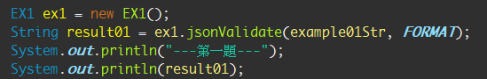
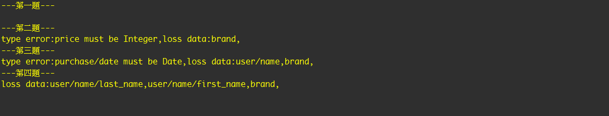

# 專案講解
###### java version :JavaSE1.8
###### 主程式放置src/exe/Example.java


###### 模組位置:src/api/JsonValidate.java

```
public interface JsonValidate {
 public String jsonValidate(String json, String format);
}
```
建立介面類別，後續依需求進行實作。

實作介面位置:src/api/impl
實作介面大致分成以下區塊:
1. 重寫JSONObject格式
    透過Tools.java內該方法reWriteJsonObj(JSONObject jsonObj)進行重寫JSONObject。
    其目的是將JSONObject物件中含有子物件(JSONObject)改寫至父結節點
    如：
    
    ```
    user:{name:{first_name:String,last_name:String},brand:String}
    ```
    改寫成：
    ```
    {"user/name/last_name":"String","user/name/first_name":"String","brand":"String"}
    ```
    
2. 判斷是否有資料缺失
    ```
    try {
        targetJsonObj.get(formatJsonObjKey);
        } catch (JSONException e) {
        lossDatarray.add(formatJsonObjKey);
        }
    ```
    將format字串轉JSON物件，透過其key值反查目標JSON物件是否有該值
    若沒有該值，將訊息寫入lossDatarray清單中。
    
3. 判斷資料型別

    ```
    targetJsonClass = targetJsonObj.get(formatJsonObjKey).getClass();
    formatJsonClass = Class.forName(CLASSPATH + formatJsonObj.optString(formatJsonObjKey));
    if (!targetJsonClass.getTypeName().equals(formatJsonClass.getTypeName())) {	typeErrorArray.add(formatJsonObjKey
     + " must be "+formatJsonObj.optString(formatJsonObjKey));}
   ```
   利用反射技術透過查核字串建立類別後與目標確認是否同一類別。
   
執行結果
